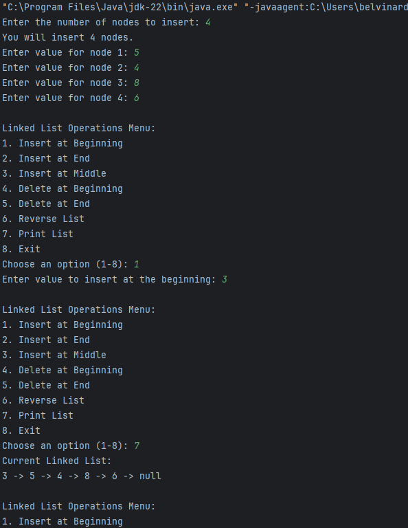

# Singly Linked List Program 📚

This Java program implements a **Singly Linked List** with various operations, allowing users to manipulate the list effectively. The available operations include inserting nodes at different positions, deleting nodes, and reversing the list. The user can also specify the number of nodes to insert.

# Image of the project


## Table of Contents 🗂️
- [Features](#features)
- [How It Works](#how-it-works)
- [Getting Started](#getting-started)
- [Usage](#usage)
- [Code Overview](#code-overview)
- [Differences Between Insertion Methods](#differences-between-insertion-methods)
- [Contributing](#contributing)

## Features ✨

- **Insert Node at Beginning**: Add a new node at the start of the list.
- **Insert Node at End**: Add a new node at the end of the list.
- **Insert Node at Middle**: Add a new node at a specified position.
- **Delete Node at Beginning**: Remove the first node from the list.
- **Delete Node at End**: Remove the last node from the list.
- **Reverse the List**: Reverse the order of nodes in the list.
- **Print List**: Display the current state of the linked list.

## How It Works 🛠️
1. The program prompts the user to enter the number of nodes they want to insert.
2. It collects the values for each node based on user input and inserts them at the end of the list.
3. Users can choose to perform various operations on the linked list, such as inserting, deleting, and reversing nodes.
4. Finally, the program displays the current state of the linked list.

## Getting Started 🚀
To get started with this program, you need to have Java installed on your system. Follow these steps:

1. **Clone the repository or download the files.**
   ```bash
   git clone https://github.com/yourusername/singly-linked-list.git
   cd singly-linked-list

## Usage 💻

Once the program is running:

1. **Specify the number of nodes** to insert when prompted.
2. **Input the values** for each node as prompted.
3. **View the linked list** displayed in the terminal.

## Code Overview 📝

The program consists of three classes:

- **Node**: Represents each element in the linked list, holding data and a pointer to the next node.
- **SinglyLinkedList**: Contains methods to manage the linked list, including inserting, deleting, and reversing nodes.
- **Main**: The main class to test the implementation and interact with the user.

## Differences Between Insertion Methods ⚖️

- **Insert at the Beginning**:
  - **Operation**: Adds the new node at the start of the list.
  - **Time Complexity**: O(1) - Constant time.
  - **Order**: Reverses the order of elements.

- **Insert at the End**:
  - **Operation**: Adds the new node at the end of the list.
  - **Time Complexity**: O(n) - Linear time (requires traversal).
  - **Order**: Maintains the order of elements.

- **Insert at the Middle**:
  - **Operation**: Adds the new node at a specified position in the list.
  - **Time Complexity**: O(n) - Linear time (requires traversal).
  - **Order**: Depends on the specified position.

Choosing the appropriate insertion method depends on the use case and desired behavior of the linked list.

## Contributing 🤝

Feel free to contribute by opening issues or submitting pull requests. Your contributions help improve the project!

## License 📜

This project is licensed under the MIT License - see the [LICENSE](LICENSE) file for details.
